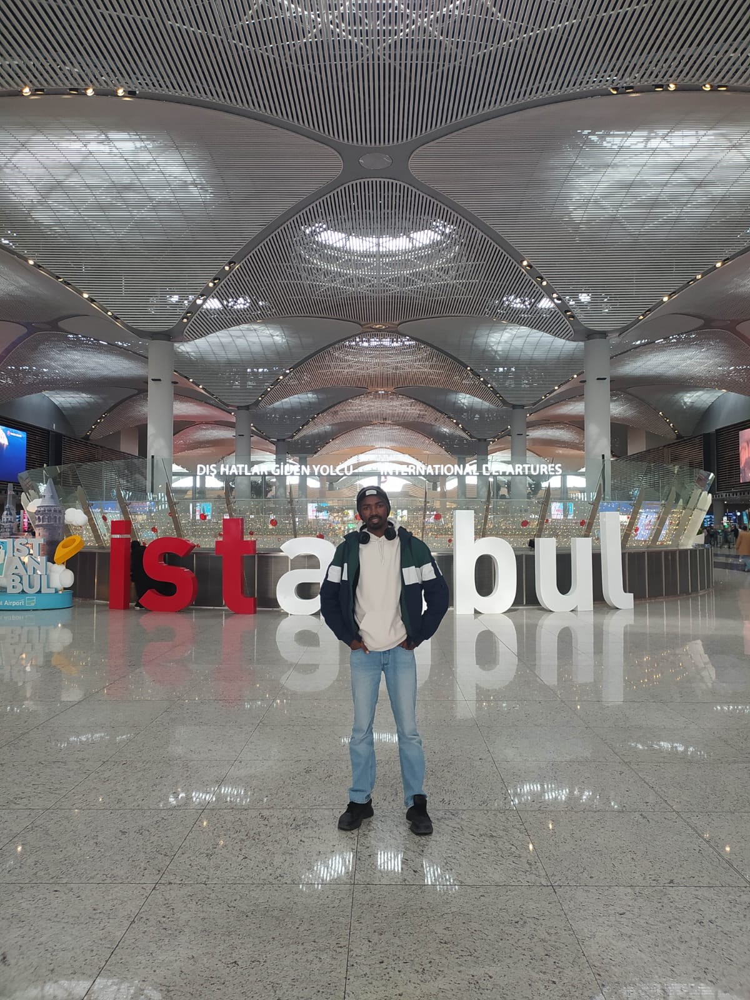
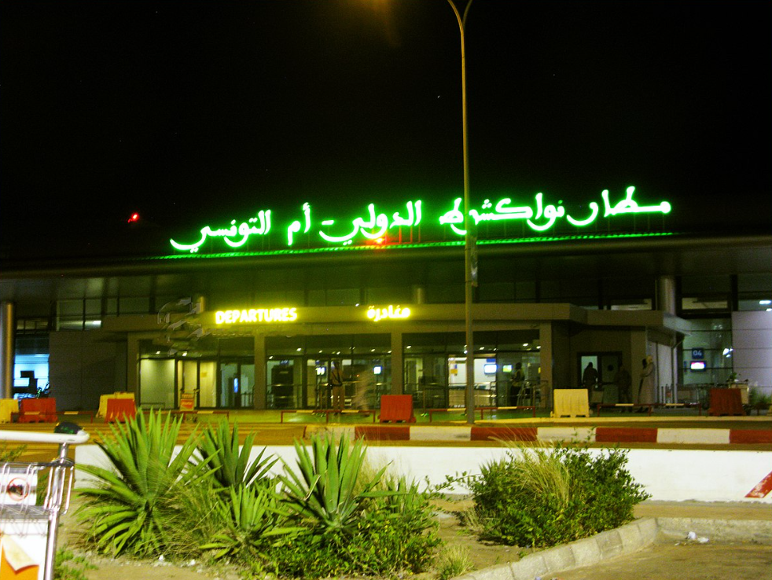
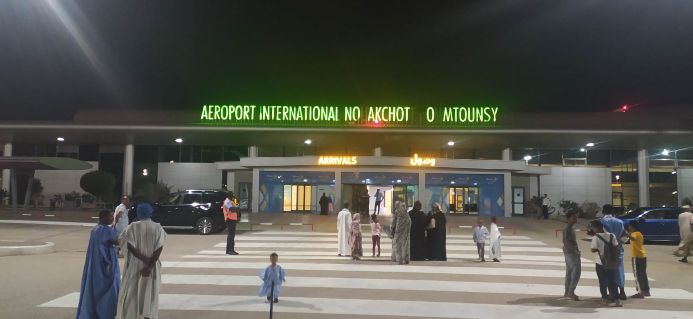
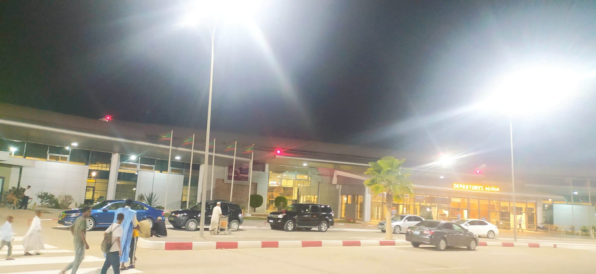
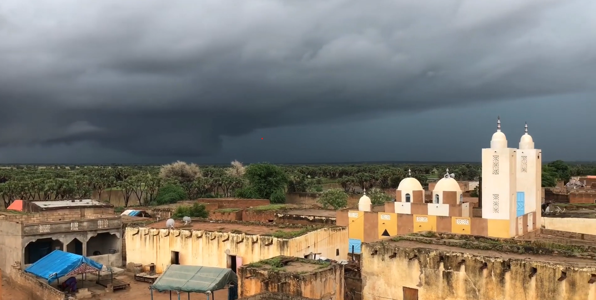
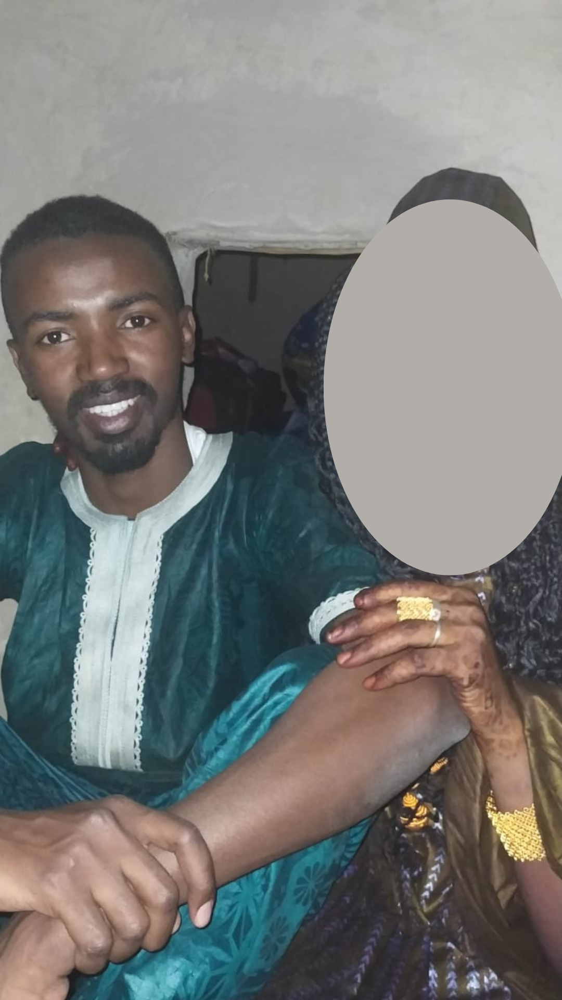

## INTRODUCTION

### FOREWORD
I recently went back on a trip to my home country of Mauritania after 5 years of living abroad, and it was unbeliaveable and an amazing experience. I got see my familly, reexplore some old places in the country with a wider and more analytical view. In this blog post, I will share some of my adventures and highlight some of the things that made my trip so special. I hope you enjoy it!

:::note
Some of my friends are opposed to my idea of posting such videos about Mauritania or Africa in general. They claim that it diminishes Africa and presents it in a negative light. Some of my close friends have even gone as far as to say that I am a traitor to Africa and that I am trying to destroy the image of Africa in the eyes of the world by posting those videos on the internet xDDD.

However, I am not concerned about their opinions. I have made it clear that the places shown in the video represent an insignificant fraction of Mauritania, let alone Africa. Mauritania, despite being one of the least developed countries in Africa(unfortunetely), has tons of wonderful places that I myself didn't visit yet.

Africa has a multitude of amazing places, and anyone from outside of Africa who thinks that what is shown in a poorly made documentary for financial gain is all there is to Africa has deceived themselves.

The majority of the videos I have presented thus far showcase road trips within the city of Nouakchott for the purpose of running errands or to my hometown where I spent my formative years. Regrettably, I have yet to share any videos that capture the splendor of Mauritania's stunning beaches, breathtaking landscapes, fascinating people, rich cultural heritage, delectable cuisine, captivating music, or iconic mosques - all of which are among the many treasures that Mauritania has to offer.

Furthermore, I am confident that none of my friends loves Africa more than I do. I have represented Africa not only in Africa but also internationally as a Black Muslim and a human being. None of them wants what is best for Africa more than I do. Therefore, I ask them to focus on their own affairs and not waste my time. If they do not like what they see in some parts of Africa, they should take action to change it right now, instead of wasting their time trying to discredit me. 

Thank you for your time and consideration.
:::

## ABOUT ME

What's poppin' my friend! My name is Demba Sow, and I'm a proud citizen of Mauritania. For the last five years, I've been living and studying in Türkiye, pursuing my passion for Computer Engineering. But, I'm not just a tech geek! I'm also a huge travel enthusiast and love exploring different cultures. 

While I've been lucky enough to visit some incredible European countries, nothing compares to the warmth and beauty of my beloved homeland. That's why I decided to take a trip back to Mauritania and catch up with my family, all while experiencing the country in a new light. 

I couldn't wait to see how Mauritania has changed since the last time I was there(Since September, 12th 2018) and check in on how the people were doing. Even though there were some tragic events that occurred, I was still inspired by the resilience of the country and its people. 

So, sit back and get ready to join me on this adventure as I take you through my amazing journey. 

Hope you enjoy the ride!

## THE TRIP

On March 9th, I set out on a grand adventure to my homeland of Mauritania. I was pumped to reunite with my loved ones and get to know my country all over again. I took off from Istanbul Airport at 3 PM, and even though the flight was a bit lengthy, I managed to catch some Z's before landing in Nouakchott, the capital of Mauritania, at 7 PM local time. The journey from Istanbul to Nouakchott is an 8-hour direct flight with a 3-hour time difference. But let me tell you, the service and food on the plane were out of this world! The flight attendants were super sweet and the food was scrumptious.

As soon as I got off the plane and picked up my phone, my cousin rang me with the news of my brother's car accident. I was heartbroken and taken aback. I immediately started trying to catch a taxi to the city center, but even with the airport renovations, there was still no public transportation available, and it was a whopping 35km away. Finally, I found a taxi driver who would take me for 1500 MRU, which was around 45 bucks. I was floored by the price, so I started haggling with him, but I didn't have any Mauritanian currency on me.

After going around trying to figure out a way, my bro Habibullah appeared! He was a young Mauritanian guy who is coming from Russia and was stopping over in Istanbul. We'd actually met on the flight and had an awesome chat. Habibullah offered to wait with me for his mom to come pick him up and then take me with them to the city center. 

Photo by [Mauritania Airways](https://www.facebook.com/MauritaniaAirways/)

Photo by ME[REDMI NOTE 8]

Photo by ME[REDMI NOTE 8]

After waiting for around 30 minutes, Habibullah's mom finally arrived, and we set off on our journey to the city center. It took us about an hour to get there, but finally, we arrived! Habibullah and his mom were incredibly kind to drop me off near my cousin's house, and I took a taxi to my final destination. It was already 11 PM when I arrived, and my sister was waiting for me. She had come straight from the hospital to greet me.

When we arrived at my cousin's house, the whole gang was waiting for me at the front door. They were excited to see me (cue the fanfare!). Seeing my sister again after five years was an emotional moment, and we hugged and cried[Before realizing that, I am too old to cry xDDD]. We finally went inside, and I was thrilled to be back in my cousin's home - my second home. 

I wanted to visit my brother at the hospital right away, but they wouldn't let me. They said he was doing better and that I could see him the next morning. I was bummed out, but I knew I had to accept it and just wait until the morning.

## THE FIRST DAY
After a restless night of worrying, I woke up super early at around 4 AM and dragged my sister out of bed to go see my brother at the hospital. I just couldn't wait any longer! We arrived at the hospital, and I was so relieved to see that he was in a slightly better condition, even though he was paralyzed. The doctors gave us the news that he was going to be okay and that he would be able to walk again. I was overjoyed to hear that and thrilled to see my brother again.

At the hospital, I also met up with my other sister and cousin who had been there since the previous day. It was great to be reunited with them and to feel the love and support of my family. We spent the rest of the day at the hospital, catching up and making plans for the future.

## THE NEXT DAYS[HOSPITAL DAYS]
We spent the entire next week at the hospital, hoping and praying for my brother's recovery. Unfortunately, on the 13th of March, he passed away. It was a devastating moment that I will never forget.

Before coming to Mauritania, I had plans to visit many of the country's beautiful places, try new foods, and explore all the amazing treasures that Mauritania had to offer. However, after the incident, I had to cancel all my plans and spend my time at the hospital.

Although I couldn't capture as much footage as I wanted to due to my brother's situation, I did manage to take a few unplanned videos while walking between the hospital and the other parts of the city. These moments were unexpected but still precious to me, and I believe they're worth sharing. It's a reminder that life doesn't always go according to our plans, but we must still cherish the moments that we do get to experience.

:::note
Just wanted to let you know that I'm still tinkering with this darn video play icon so it'll start automatically and make your life easier. As soon as I've got it sorted, I'll update this post so you can sit back, relax, and watch the video without lifting a finger! xDDD But for now, you'll just have to click on that link below like a regular human being. Don't worry, it won't hurt...much. 
:::
### VIDEO 1: SOME ROAD VIEWS IN NOUAKCHOTT

<iframe width="fit" height="fit" src="https://www.youtube.com/embed/j0F4_HFKUxE?si=R07bjMWrp2_5zqSu" title="YouTube video player" frameborder="0" allow="accelerometer; autoplay; clipboard-write; encrypted-media; gyroscope; picture-in-picture; web-share" allowfullscreen></iframe>

These are some random views of the roads in Nouakchott, but they don't represent the best roads in the city. As I mentioned in previous texts and in the video, there are more beautiful roads and places in Mauritania, which you can find by searching online. Nonetheless, I hope you enjoy the glimpse of Nouakchott that I could capture.

I apologize for the poor quality of this video. I was in a hurry to do some paperwork, and the filming wasn't very clear and accurate.

"Thiothiorgal" is a traditional natural toothbrush that has been used for a long time and is still popular today. According to doctors and experts, it is more effective and healthier than modern toothbrushes. In Mauritania, most people still use it in a daily basis to brush their teeth, and it is a very common sight to see people using it in the streets since you don't have to spit(NOT CRINGE, SHUT UP xDD). Well camels use it too, but that's a different story. xDDD

### VIDEO 2: ROAD VIEWS BETWEEN NOUAKCHOTT AND KIFFA A CITY 600 KM AWAY FROM HOME:

<iframe width="fit" height="fit" src="https://www.youtube.com/embed/cGfBmTu9hLI?si=oL2LKcx4AVydMfKW" title="YouTube video player" frameborder="0" allow="accelerometer; autoplay; clipboard-write; encrypted-media; gyroscope; picture-in-picture; web-share" allowfullscreen></iframe>

My village is on the western part of Mauritania, which is on the opposite side of Nouakchott. It takes around 24 hours to get there by car, and the road is not super good unfortunetelly. It's a long and bumpy ride but it's worth i. During those seasons, Mauritania is mostly dry, but there are some places that are green and beautiful like the OASIS I have showed on the video. As you can see, the road is mostly some dunes, sand and dry mountains with some green trees here and there. It's a beautiful sight to see, but it's not on its best during the this time. 

### VIDEO 3: ROAD TRIP BETWEEN OULD YENGE AND HOME:

<iframe width="fit" height="fit" src="https://www.youtube.com/embed/lC7HxA-ycOk?si=KakV3-XjWYv2efyQ" title="YouTube video player" frameborder="0" allow="accelerometer; autoplay; clipboard-write; encrypted-media; gyroscope; picture-in-picture; web-share" allowfullscreen></iframe>

After spending a 8 hrs on the trip, we finally arrived where I spent a night on a friend's house. I decided to go back home the next day passing by a city 15 KM away from home called OULD YENGE. Here resides my sister and her husband, and I wanted to spend some time with them. She was so happy to see me again, after all of this years. 
Finally, my sister decided to go home with my, and we spent the day at her shop. At the evening, we went back home.

Picture of Ould Yenge by [FulaniTrendGroup](https://www.youtube.com/@fulanitrendsgroup1180)

Ould Yenge is a city 15KM away from My village where I did my middle school study back in 2012-2015. I had a lot of friends there whom I was able to recognize but mostly none of them  was able to do so claiming that [I AM TOO OLD TO GET RECOGNIZED] LOL. I was so happy to see them again, and I spent some time with them.

It was tired, that I exited at the same time, I mostly forget to take pictures. And it's kinda weird to sound like a paparazzi in a small city. xDDD

After enduring an 8-hour journey, we finally reached our destination where I bunked at a friend's place for the night. The next day, I decided to head back home, but not without stopping by OULD YENGE - a bustling city just 15KM away from my humble abode. This is where my beloved sister and her husband reside, and I was stoked to catch up with them. As expected, my sister was over the moon to see me after all these years.

We spent the day hanging out at her shop, reminiscing about old times and catching up on everything that has happened in our lives. Later that evening, my sis accompanied me back home. Oh, and did I mention that Ould Yenge is where I attended middle school from 2012-2015? I bumped into some old friends, but most of them couldn't recognize me,claiming that [I AM TOO OLD TO GET RECOGNIZED] LOL, Hilarious, right?

To be honest, I was so knackered from the trip that I forgot to snap pictures of my adventure. Plus, it's kinda weird to sound like a paparazzi in a small city. xDDD Can't a guy catch a break?

For you to not confuse me with my sister, I'm the one with the beard. xDDD

After a long day at my sister's shop[She's boring and her jokes are OG xDDD], I couldn't wait to head back home. My excitement was through the roof, as I was about to see my beloved family after such a long time. My parents, younger sister, nephew, and two little nieces - who were born while I was away - were waiting for me. It was going to be a heartwarming reunion, and I couldn't wait to be home.

As you watch the video, you can witness the stunning natural scenery of my village nestled between the towering dunes and majestic mountains. Although I must admit, this may not be the ideal season to capture the full beauty of the village. Our journey from the dunes to the village was like a surreal experience, as I reminisced about the familiar landmarks and trees that marked the way home.

Between July and December, Mauritania experiences a stunning transformation with lush greenery and nonstop rainfall. It's truly a sight to behold! During this time, I used to watch over cows in the jungle to ensure their safety at night. As a result, I became intimately familiar with the terrain and the various trees in the area.

### 4. ARRIVING HOME

Around 7 PM, I finally arrived home and was hoping that I had captured the moment on camera, so I wouldn't have to explain it. It was a heartwarming moment as I reunited with my family. As we greeted each other, my parents were crying tears of joy, and I kept repeating to myself "BIG BOYS DON'T CRY" to hold back my own tears. It was a wonderful moment that I will cherish forever. The adventure continued the next day as my energetic little nieces kept jumping all over me nonstop.

<!--  -->
Due to some privacy manners, I have decided to not show the faces of some of family members on the videos or their faces on the pictures. 
<!--  -->

### 5. TRYING OUT SOME ACTIVITIES

#### 5.1. COLLECTING WATER FROM A TRADITIONAL WATER WELL:

<iframe width="fit" height="fit" src="https://www.youtube.com/embed/kQesL2y8Ojs?si=suSV4l5Czl5cJApL" title="YouTube video player" frameborder="0" allow="accelerometer; autoplay; clipboard-write; encrypted-media; gyroscope; picture-in-picture; web-share" allowfullscreen></iframe>

In this video, you can see a young shepherd, who also happens to be my nephew(relative's sun), collecting water from a traditional water-well to water his sheep. He uses a bucket to collect the water and skillfully pours it into a trough for the sheep to drink from. It's amazing to see how smart and capable village kids are, they learn quickly and can do anything!

#### 5.2. COLLECTING WATER FROM A MODERN WATER WELL:

<iframe width="fit" height="fit" src="https://www.youtube.com/embed/thWPvnEfy0A?si=wC3ezRp5WHNftA08" title="YouTube video player" frameborder="0" allow="accelerometer; autoplay; clipboard-write; encrypted-media; gyroscope; picture-in-picture; web-share" allowfullscreen></iframe>

These are the clean water wells that we use for drinking water. It's a bit challenging to retrieve water from them, but it's a great workout! On that day, I went with my brother Adam, nephew, and niece to fill up seven 20-liter containers. It was a fantastic natural workout session! Isn't it?

#### 5.3 COLLECTING SOME TROPICAL FRUITS[KAAROOJE]:

<iframe width="fit" height="fit" src="https://www.youtube.com/embed/XdvY0Wzneto?si=XGV7eHFSRYyTWDOo" title="YouTube video player" frameborder="0" allow="accelerometer; autoplay; clipboard-write; encrypted-media; gyroscope; picture-in-picture; web-share" allowfullscreen></iframe>

Allow me to introduce you to a delightful tropical fruit known as "Kaarooje" in the Fulani language. This succulent treat is native to light deserts and boasts a delightful tangy flavor that will tantalize your taste buds. Not only is it a superb source of vitamin C, but it also contains a host of other essential vitamins that I'm not entirely sure about - but hey, that just adds to the element of surprise, right?

As a proud aficionado of "Kaarooje," I can personally attest to its delectable taste and numerous health benefits. I implore you to try it for yourself if you ever have the pleasure of visiting Mauritania - trust me, it's a must-try! And if you truly want the ultimate "Kaarooje" experience, head on over to my village - we pride ourselves on having the best of the best.xD

## PHYLOSOPHY
[STILL UNDER REVISION]
HERE I'LL BE WRITING A MORAL STORY ABOUT THE IMPORTANCE OF:
1. LIFE IN GENERAL
2. PRODUCTIVITY AND HARD WORK.
3. GREATFULNESS
AND MORE

## CONCLUSION
[STILL UNDER REVISION AS WELL]
[ILL BE TALKING ABOUT THE IMPORTANCE OF TRAVELING AND LEARNING ABOUT OTHER CULTURES]
In conclusion, my trip to Mauritania was an unforgettable experience. I highly recommend visiting this beautiful country and immersing yourself in its rich culture and traditions. Whether you're interested in exploring the Sahara desert, trying local cuisine, or learning about traditional music and dance, Mauritania has something for everyone. I hope this blog post has inspired you to consider adding Mauritania to your travel bucket list!